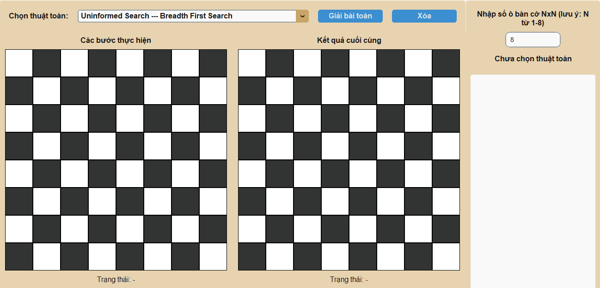
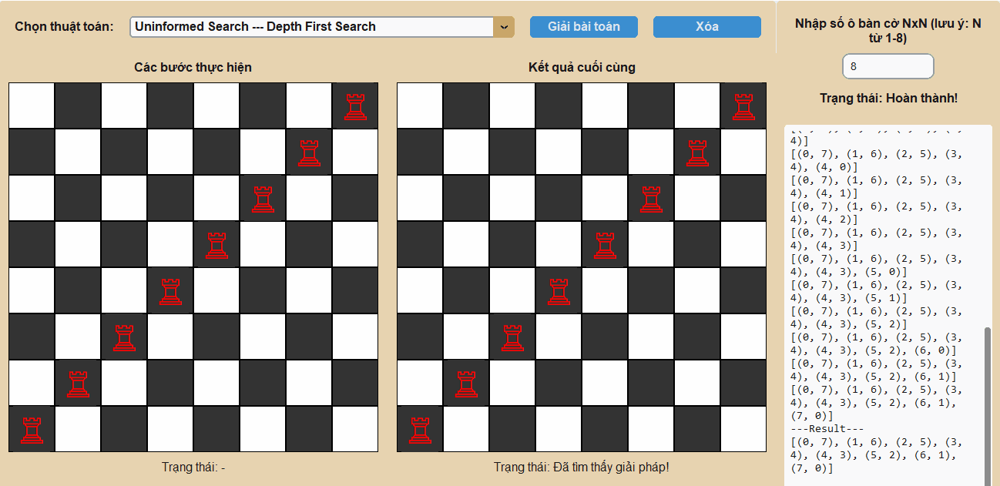
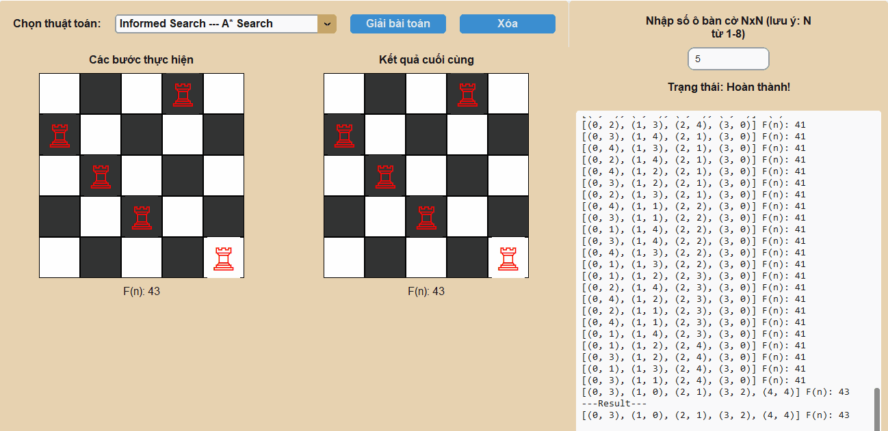
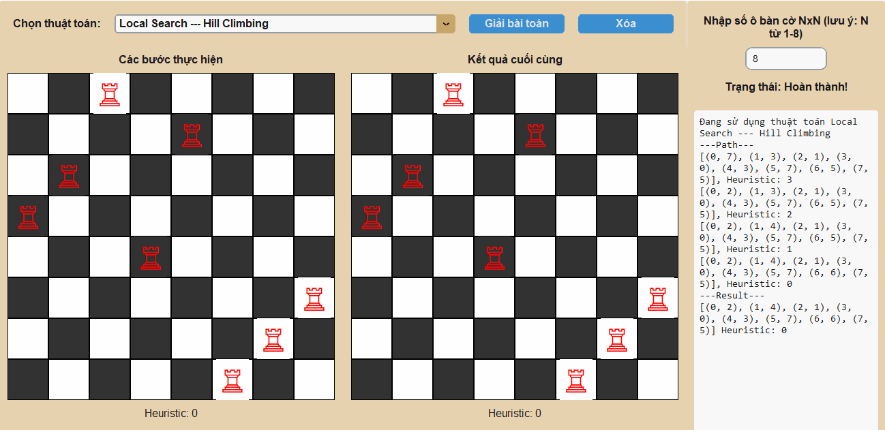
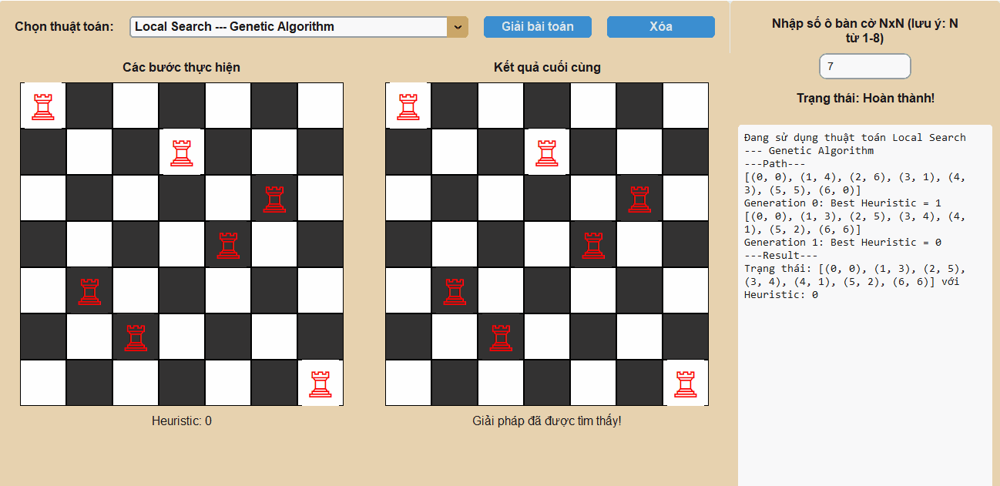
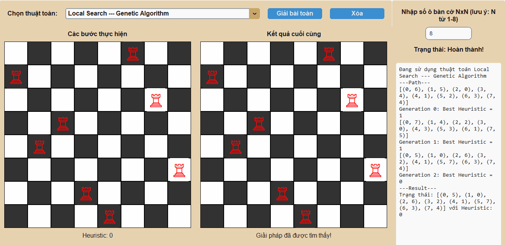
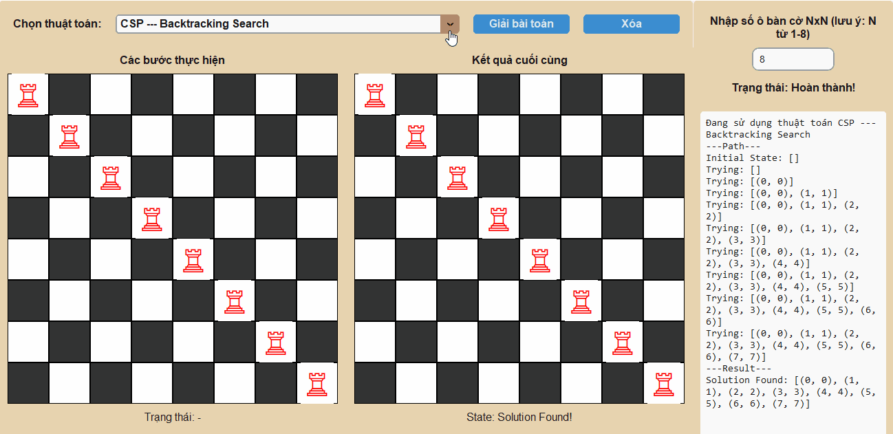
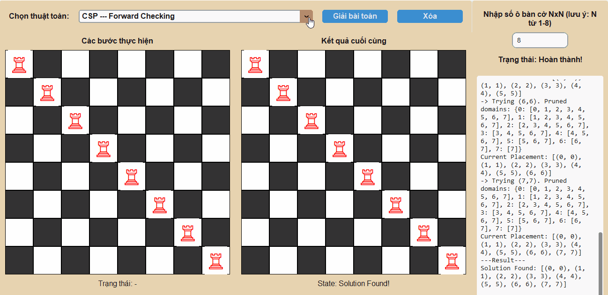
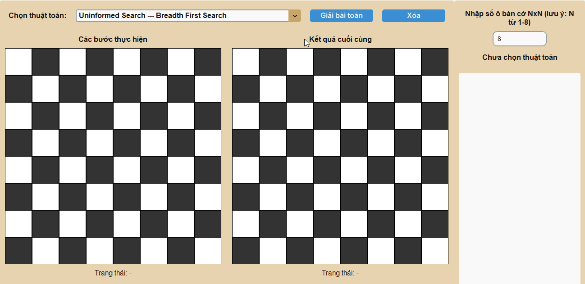
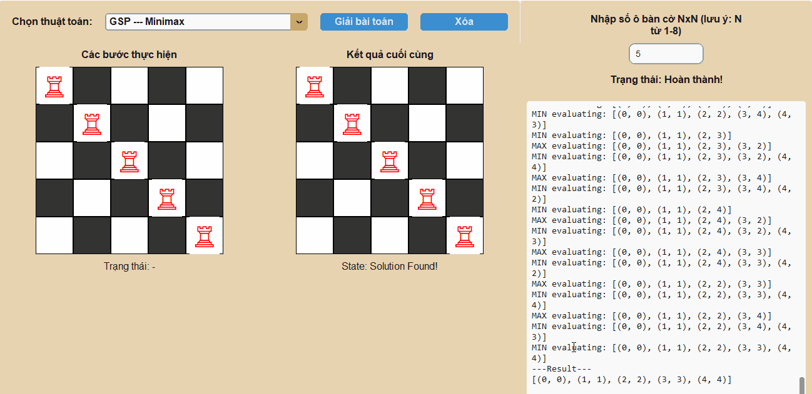

# ♟️ BÁO CÁO BÀI TẬP CÁ NHÂN MÔN TRÍ TUỆ NHÂN TẠO 💡

---

## 1. THÔNG TIN CÁ NHÂN

* **Họ và tên:** Nguyễn Sư Thành Đạt
* **Mã số sinh viên:** 23110089
* **Môn học:** Trí tuệ Nhân tạo
* **Lớp:** ARIN330585_05CLC Buổi: Sáng thứ 2 - thứ 6, tiết 1 - 4

---

## 2. TỔNG QUAN VỀ BÀI TOÁN: N QUÂN XE (N-Rooks Problem)

### 2.1. Mô tả Bài toán

Bài toán đặt **N quân Xe** (Rooks) lên một bàn cờ **$N \times N$** (0 < N < 9)sao cho không có quân Xe nào có thể tấn công quân Xe khác.

* **Mục tiêu (Goal State):** Đặt N quân Xe sao cho mỗi hàng và mỗi cột chỉ có **đúng một** quân Xe. Điều này đảm bảo không có hai quân Xe nào nằm trên cùng một hàng hoặc cùng một cột.

### 2.2. Biểu diễn Trạng thái

Trạng thái của bài toán được biểu diễn dưới dạng một danh sách các bộ `(hàng, cột)` cho biết vị trí của các quân Xe đã được đặt.

* **Trạng thái Ban đầu:** Một danh sách rỗng `[]`, tương ứng với một bàn cờ trống.
* **Trạng thái Đích:** Một danh sách gồm N bộ `(hàng, cột)`, trong đó tất cả các giá trị `hàng` và tất cả các giá trị `cột` là riêng biệt, ví dụ: `[(0, 0), (1, 1), ..., (N-1, N-1)]`.

---

## 3. CẤU TRÚC GIAO DIỆN VÀ CHỨC NĂNG

### 3.1. Cấu Trúc Và Chức Năng

Ứng dụng được xây dựng bằng thư viện `customtkinter` của ngôn ngữ lập trình Python với giao diện hiện đại và trực quan.

1.  **Khung bên Trái:**
    * **Bảng điều khiển:**
        * **Combobox:** Cho phép chọn một trong các thuật toán đã triển khai.
        * **Nút "Giải bài toán":** Bắt đầu thực thi thuật toán đã chọn.
        * **Nút "Xóa":** Xóa các quân Xe khỏi bàn cờ.
    * **Bàn cờ "Các bước thực hiện":** Trực quan hóa quá trình tìm kiếm hoặc các bước đi của thuật toán.
2.  **Khung bên Phải:**
    * **Tùy chọn bàn cờ:** Cho phép người dùng nhập kích thước bàn cờ N x N (từ 1 đến 8).
    * **Bảng ghi log:** Hiển thị chi tiết các bước, trạng thái đã duyệt, và kết quả của thuật toán dưới dạng văn bản.
    * **Bàn cờ "Kết quả cuối cùng":** Hiển thị lời giải cuối cùng mà thuật toán tìm được.

### 3.2. Lưu ý về Mã nguồn và Hiển thị

* **Logic Sinh Trạng thái:** Các thuật toán tìm kiếm truyền thống (Uninformed, Informed, CSP) sinh trạng thái bằng cách đặt quân Xe theo thứ tự từng hàng, giúp giảm không gian tìm kiếm một cách hiệu quả.
* **Trực quan hóa:** Giao diện cập nhật từng bước đi của thuật toán trên bàn cờ bên trái và hiển thị kết quả cuối cùng ở bàn cờ bên phải, giúp người dùng dễ dàng theo dõi và so sánh.
* **Logging:** Mọi hành động, từ việc thử một trạng thái mới, quay lui, đến cắt tỉa (pruning), đều được ghi lại chi tiết trong ô log, cung cấp cái nhìn sâu sắc về cách hoạt động của từng thuật toán.
* **Chương trình có thể nhập bàn cờ $N \times N$ với N từ 1 -> 8. Vì nhanh và trực quan hơn thì em xin phép chèn ảnh động GIF ở bàn cờ $5 \times 5$, nếu thuật toán cho phép em sẽ quay ở bàn cờ $8 \times 8$**

---

## 4. CÁC THUẬT TOÁN ĐÃ TRIỂN KHAI

Mã nguồn đã triển khai một dải rộng các thuật toán, được phân loại rõ ràng và lựa chọn thông qua giao diện người dùng.

### 4.1. Nhóm Thuật Toán Tìm kiếm Không Có Thông Tin (Uninformed Search)

1.  **Breadth First Search (BFS):**
- Thuật toán BFS thực hiện tìm kiếm theo chiều rộng, tức là nó sẽ duyệt qua tất cả các trạng thái (cách đặt quân xe) ở cùng một "cấp độ" trước khi đi xuống cấp độ sâu hơn. Trong bài toán này, "cấp độ" có thể hiểu là số lượng quân xe đã được đặt lên bàn cờ.
  * **Cấp 0:** Bàn cờ trống `[]`.
  * **Cấp 1:** Tất cả các trạng thái có 1 quân xe, ví dụ: `[(0, 0)]`, `[(0, 1)]`,...
  * **Cấp 2:** Tất cả các trạng thái có 2 quân xe, ví dụ: `[(0, 0), (1, 1)]`, `[(0, 0), (1, 2)]`,...
  * ... và cứ thế tiếp tục.
- Cách tiếp cận này đảm bảo rằng nếu có lời giải, BFS sẽ tìm ra lời giải có số bước đi (số quân xe) ít nhất.
   
2.  **Depth First Search (DFS):**
  - Trái ngược với BFS, thuật toán DFS thực hiện tìm kiếm theo chiều sâu. Tức là, nó sẽ ưu tiên đi sâu vào một nhánh của cây tìm kiếm cho đến khi nào không thể đi tiếp được nữa (đạt đến "lá" hoặc trạng thái cụt) rồi mới quay lui (backtrack) để thử một nhánh khác. Trong bài toán N-Rooks, điều này có nghĩa là thuật toán sẽ cố gắng đặt quân xe thứ nhất, rồi thứ hai, thứ ba,... một cách nhanh nhất có thể theo một hướng duy nhất. Nếu việc đặt quân xe tiếp theo bị chặn, nó sẽ quay lại bước trước đó và thử một vị trí khác. Cách tiếp cận này thường tìm ra lời giải rất nhanh, nhưng không đảm bảo lời giải đó là tối ưu nhất (trong các bài toán có chi phí).
    
3. **Uniform Cost Search (UCS)**
  - UCS mở rộng các trạng thái dựa trên chi phí thấp nhất tính từ trạng thái ban đầu (g(n)). Nó không quan tâm đến "số bước đi" như BFS, mà quan tâm đến "tổng trọng số" của đường đi. Trong bài toán này, chi phí được định nghĩa là cost = 2 * (self.n - len(positions)) + 1, tức là ưu tiên các bước đi giúp giảm thiểu số ô bị chặn.
  - Thuật toán sử dụng một hàng đợi ưu tiên (Priority Queue) để luôn chọn trạng thái có tổng chi phí g(n) nhỏ nhất để xét duyệt tiếp theo. Điều này đảm bảo rằng đường đi tìm được (nếu có) sẽ là đường đi có tổng chi phí thấp nhất.
    
4. **Depth Limited Search (DLS)**
  - DLS là một biến thể của DFS, nhưng có thêm một tham số là **giới hạn độ sâu (limit)**. Nó sẽ thực hiện tìm kiếm sâu cho đến khi đạt đến giới hạn này. Nếu không tìm thấy lời giải trong giới hạn đó, nó sẽ dừng lại.
  - Thuật toán sử dụng đệ quy để duyệt sâu. Nếu độ sâu hiện tại bằng `limit`, nó sẽ ngừng nhánh đó lại. Điều này giúp ngăn chặn việc DFS đi vào các nhánh vô hạn trong những bài toán phức tạp hơn. Trong bài toán N-Rooks, giới hạn được đặt bằng N.
    
5. **Iterative Deepening Search (IDS)**
  - IDS là sự kết hợp thông minh giữa BFS và DFS. Nó thực hiện một loạt các cuộc gọi DLS với giới hạn độ sâu tăng dần (0, 1, 2, ..., N).
  - Nó bắt đầu bằng cách tìm kiếm ở độ sâu 0, sau đó là 1, rồi 2, và cứ thế tiếp tục. Bằng cách này, nó vừa có được ưu điểm về bộ nhớ của DFS (vì mỗi lần chỉ duyệt sâu một nhánh), vừa đảm bảo tính hoàn chỉnh và tối ưu về số bước như BFS (vì nó sẽ tìm thấy lời giải ở độ sâu nông nhất trước).
    

### 4.2. Nhóm Thuật toán Tìm kiếm có Thông tin (Informed Search)

1. **Greedy Search**
   - Greedy Search là một thuật toán "tham lam". Tại mỗi bước, nó luôn chọn hành động có vẻ tốt nhất tại thời điểm đó, dựa trên một hàm **heuristic (`h(n)`)**. Hàm heuristic ước tính chi phí từ trạng thái hiện tại đến đích. Trong mã nguồn, `h(n) = abs(N - x - 1) + abs(N - y - 1)`, ước tính khoảng cách Manhattan đến góc dưới bên phải.
   - Tương tự UCS, nó dùng hàng đợi ưu tiên nhưng chỉ sắp xếp dựa trên giá trị heuristic `h(n)`. Nó bỏ qua chi phí đã đi (`g(n)`), do đó có thể tìm ra lời giải nhanh nhưng không đảm bảo là tối ưu nhất.
   
2. **A\* Search**
   - A\* là sự kết hợp của UCS và Greedy Search. Nó đánh giá các trạng thái dựa trên tổng của chi phí thực tế từ đầu đến hiện tại (`g(n)`) và chi phí ước tính đến đích (`h(n)`). Hàm đánh giá là `f(n) = g(n) + h(n)`.
   - Nó sử dụng hàng đợi ưu tiên để luôn chọn trạng thái có `f(n)` thấp nhất. Sự kết hợp này giúp A\* vừa có định hướng (nhờ `h(n)`), vừa cân nhắc chi phí đã đi (nhờ `g(n)`), đảm bảo tìm ra lời giải có tổng chi phí thấp nhất nếu hàm heuristic là hợp lệ (admissible).
   

### 4.3. Nhóm Thuật toán Tìm kiếm Cục bộ (Local Search)

*Lưu ý: Các thuật toán này bắt đầu với một trạng thái hoàn chỉnh (đặt đủ N quân xe) và cố gắng cải thiện nó thay vì xây dựng từ đầu.*

1. **Hill Climbing**
   - Thuật toán bắt đầu với một lời giải ngẫu nhiên. Sau đó, nó liên tục di chuyển đến trạng thái "láng giềng" tốt hơn (có heuristic thấp hơn - ít cặp quân xe ăn nhau hơn). Nó sẽ dừng lại khi không có láng giềng nào tốt hơn.
   - Tại mỗi bước, nó xem xét tất cả các trạng thái láng giềng (bằng cách di chuyển một quân xe sang một ô khác trong cùng một hàng) và chọn trạng thái có heuristic tốt nhất. Nhược điểm là dễ bị "mắc kẹt" ở các cực tiểu cục bộ (local minima).
   
3. **Simulated Annealing**
   - Đây là một phiên bản cải tiến của Hill Climbing. Để tránh bị kẹt ở cực tiểu cục bộ, nó cho phép thỉnh thoảng di chuyển đến một trạng thái **tệ hơn** với một xác suất nhất định. Xác suất này cao lúc đầu ("nhiệt độ" cao) và giảm dần theo thời gian.
   - Nó chọn một láng giềng ngẫu nhiên. Nếu láng giềng tốt hơn, nó sẽ di chuyển. Nếu tệ hơn, nó vẫn có thể di chuyển dựa trên một xác suất `exp((current_h - next_h) / temperature)`. "Nhiệt độ" giảm dần giúp thuật toán hội tụ về một giải pháp tốt.
   
5. **Genetic Algorithm**
   - Thuật toán này mô phỏng quá trình tiến hóa tự nhiên. Nó duy trì một "quần thể" gồm nhiều lời giải. Qua các "thế hệ", các lời giải tốt nhất sẽ được "chọn lọc", "lai ghép" (crossover) và "đột biến" (mutation) để tạo ra thế hệ mới tốt hơn.
      * **Hoạt động:**
          * **Chọn lọc:** Chọn các cá thể "khỏe mạnh" (heuristic thấp).
          * **Lai ghép:** Kết hợp hai cá thể cha mẹ để tạo ra con cái.
          * **Đột biến:** Thay đổi ngẫu nhiên một phần nhỏ của cá thể để tạo sự đa dạng.
          * Quá trình này lặp lại cho đến khi tìm được lời giải tối ưu hoặc đạt đến số thế hệ tối đa.
   
7. **Beam Search**
   - Beam Search là một biến thể của BFS nhưng có giới hạn về bộ nhớ. Thay vì giữ lại tất cả các trạng thái ở mỗi cấp độ, nó chỉ giữ lại `k` trạng thái tốt nhất (gọi là `beam_width`).
   - Từ `k` trạng thái tốt nhất hiện tại, nó sinh ra tất cả các trạng thái con. Sau đó, từ danh sách các trạng thái con này, nó lại chọn ra `k` trạng thái tốt nhất để tiếp tục cho vòng lặp tiếp theo. Điều này giúp giảm không gian tìm kiếm một cách đáng kể.
   

### 4.4. Nhóm Bài toán Thỏa mãn Ràng buộc (CSP)

1. **Backtracking Search**
   - Đây là một phương pháp duyệt sâu (DFS) cơ bản cho CSP. Nó gán giá trị (vị trí cột) cho từng biến (hàng) một cách tuần tự. Nếu một phép gán vi phạm ràng buộc (đặt quân xe vào cột đã có), nó sẽ "quay lui" (backtrack) và thử một giá trị khác.
   - Thuật toán xây dựng lời giải từng bước một. Tại mỗi hàng, nó thử đặt quân xe vào từng cột. Nếu hợp lệ, nó đi tiếp đến hàng sau. Nếu không hợp lệ hoặc không thể đi tiếp, nó quay lại hàng trước đó và thử cột khác.
   
3. **Forward Checking**
   - Đây là một cải tiến của Backtracking. Sau khi gán một giá trị cho một biến (đặt quân xe vào hàng `r`, cột `c`), nó sẽ nhìn về phía trước và loại bỏ tất cả các giá trị không tương thích khỏi "miền giá trị" của các biến chưa được gán. Cụ thể, nó sẽ loại bỏ cột `c` khỏi các lựa chọn của tất cả các hàng còn lại.
   - Khi đặt một quân xe, thuật toán sẽ cập nhật "domain" (các cột có thể đặt) của các hàng tương lai. Nếu bất kỳ hàng nào trong tương lai hết lựa chọn (domain rỗng), thuật toán biết ngay nhánh này sẽ thất bại và quay lui sớm hơn, giúp giảm không gian tìm kiếm.
   
5. **AC-3 (Arc Consistency 3)**
   - Thuật toán AC-3 là một bước tiền xử lý (hoặc thực hiện xen kẽ) để làm cho bài toán "nhất quán cung". Nó xem xét các cặp biến (hàng) và loại bỏ các giá trị (cột) khỏi miền của chúng nếu không tìm thấy giá trị tương ứng ở biến kia thỏa mãn ràng buộc.
   - Thuật toán duy trì một hàng đợi chứa các "cung" (cặp biến). Với mỗi cung `(Xi, Xj)`, nó cố gắng đảm bảo rằng với mỗi giá trị trong miền của `Xi`, có ít nhất một giá trị trong miền của `Xj` thỏa mãn ràng buộc. Nếu không, giá trị đó sẽ bị loại bỏ. Quá trình này giúp lọc bớt miền giá trị trước khi bắt đầu Backtracking, làm cho việc tìm kiếm hiệu quả hơn.
   

### 4.5. Nhóm Môi trường Phức tạp (Complex Environment Search)

1. **And-Or Search**
   - Thuật toán này được dùng cho các môi trường không tất định, nơi một hành động có thể dẫn đến nhiều kết quả. Nó tìm kiếm một **kế hoạch** (một cây con) thay vì một đường đi duy nhất.
   - Cây tìm kiếm bao gồm các nút **OR** (nơi chúng ta chọn một hành động) và các nút **AND** (đại diện cho tất cả các kết quả có thể có của một hành động). Một kế hoạch thành công khi nó có thể xử lý tất cả các kết quả ở nút AND và dẫn đến đích. Trong bài toán này, nó được mô phỏng bằng cách coi việc đặt quân xe ở mỗi hàng là một "tiểu vấn đề" phải được giải quyết.
   
3. **Belief State Search**
   - Được sử dụng trong các môi trường không quan sát được hoàn toàn, nơi agent không biết chắc mình đang ở trạng thái nào. Agent sẽ duy trì một **"trạng thái niềm tin" (belief state)**, là một tập hợp tất cả các trạng thái có thể xảy ra.
   - Thuật toán tìm kiếm trên không gian của các belief state. Nó bắt đầu với một belief state ban đầu. Mỗi hành động sẽ chuyển belief state hiện tại thành một belief state kế tiếp, là tập hợp tất cả các trạng thái có thể đạt được từ belief state cũ sau hành động đó. Mục tiêu là tìm một chuỗi hành động dẫn đến một belief state mà trong đó có chứa trạng thái đích.
   
5. **Partially Observable Search**
   - Tương tự như Belief State Search, thuật toán này cũng giải quyết các bài toán trong môi trường quan sát một phần. Agent sử dụng các **quan sát (observations)** để cập nhật và thu hẹp belief state của mình.
   - Dựa trên belief state hiện tại, agent thực hiện một hành động, sau đó nhận một quan sát. Quan sát này giúp agent loại bỏ các trạng thái không còn phù hợp khỏi belief state, tạo ra một belief state mới chính xác hơn. Quá trình tìm kiếm là tìm một chuỗi các hành động để đạt được mục tiêu, dựa trên việc cập nhật belief state này.
   

### 4.6. Nhóm Môi trường Đối kháng (Game Search Problem)

1. **Minimax**
   - Minimax được thiết kế cho các trò chơi đối kháng hai người chơi, có tổng bằng không (zero-sum). Nó giả định rằng cả hai người chơi đều chơi tối ưu. Người chơi **MAX** (ta) sẽ cố gắng **tối đa hóa** điểm số của mình, trong khi người chơi **MIN** (đối thủ) sẽ cố gắng **tối thiểu hóa** điểm số của MAX.
   - Thuật toán xây dựng một cây trò chơi. Nó đi xuống đến các trạng thái kết thúc (lá) để tính giá trị (thắng/thua). Sau đó, nó đi ngược lên, ở mỗi cấp, MAX sẽ chọn nước đi có giá trị cao nhất, và MIN sẽ chọn nước đi có giá trị thấp nhất.
   
3. **Alpha-Beta Pruning**
   - Đây là một phiên bản tối ưu hóa của Minimax. Nó giúp giảm đáng kể số lượng nút cần phải duyệt trên cây trò chơi bằng cách **cắt tỉa** các nhánh mà chắc chắn sẽ không ảnh hưởng đến quyết định cuối cùng.
   - Nó duy trì hai giá trị, **Alpha** (điểm số tốt nhất mà MAX có thể đảm bảo) và **Beta** (điểm số tốt nhất mà MIN có thể đảm bảo). Nếu trong quá trình duyệt, một nhánh có giá trị khiến cho `beta <= alpha`, nhánh đó sẽ bị cắt tỉa vì người chơi đối diện sẽ không bao giờ để cho tình huống đó xảy ra.
   

---

## 5. KẾT LUẬN VÀ BÀI HỌC KINH NGHIỆM

### 5.1. Tổng kết

Dự án đã thành công trong việc triển khai và trực quan hóa một loạt các thuật toán Trí tuệ Nhân tạo để giải quyết bài toán N-Rooks kinh điển. Bằng việc xây dựng một giao diện người dùng trực quan bằng `customtkinter`, chương trình không chỉ tìm ra lời giải mà còn cho phép người dùng quan sát, so sánh và hiểu sâu hơn về cách thức hoạt động, ưu và nhược điểm của từng phương pháp. Từ các thuật toán tìm kiếm cơ bản như **BFS, DFS** đến các phương pháp phức tạp hơn như **A\***, **Genetic Algorithm**, và **Alpha-Beta Pruning**, mỗi thuật toán đều cho thấy một cách tiếp cận khác nhau để giải quyết vấn đề, thể hiện sự đa dạng và phong phú của các kỹ thuật trong lĩnh vực AI.

### 5.2. Bài học rút ra

* **Hiểu sâu về thuật toán:** Việc trực tiếp lập trình và gỡ lỗi các thuật toán đã mang lại một cái nhìn sâu sắc và thực tế hơn nhiều so với việc chỉ học lý thuyết. Việc quan sát quá trình tìm kiếm qua giao diện giúp dễ dàng nhận ra sự khác biệt cốt lõi về hiệu quả, mức độ tối ưu và không gian bộ nhớ giữa các thuật toán.
* **Tầm quan trọng của Cấu trúc dữ liệu:** Sự lựa chọn giữa `Queue` (trong BFS) và `Stack` (trong DFS), hay `Priority Queue` (trong UCS và A\*) là yếu tố quyết định đến toàn bộ hành vi và kết quả của thuật toán.
* **Không có thuật toán nào là tốt nhất cho mọi bài toán:** Mỗi nhóm thuật toán có điểm mạnh riêng và phù hợp với các loại vấn đề khác nhau. Local Search hiệu quả cho việc tối ưu hóa, CSP mạnh mẽ trong việc xử lý các ràng buộc, và Game Search là cần thiết cho các môi trường đối kháng.
* **Trực quan hóa là một công cụ học tập mạnh mẽ:** Giao diện đồ họa và hệ thống ghi log chi tiết đã chứng tỏ vai trò quan trọng trong việc làm cho các khái niệm AI trừu tượng trở nên dễ hiểu và sinh động hơn.
Nhìn chung, dự án này là một bài tập thực hành quý báu, không chỉ củng cố kiến thức nền tảng về Trí tuệ Nhân tạo mà còn phát triển kỹ năng lập trình, giải quyết vấn đề và tư duy logic.

# Cuối cùng em xin cảm ơn Thầy/Cô/Các anh chị đã xem qua bài làm của em. Mến chúc Thầy/Cô/Các anh chị sức khỏe và thành công!
